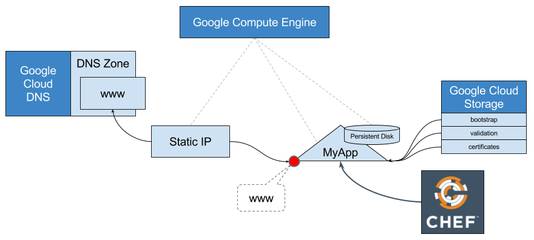

# Getting Started




## Installation

### Installing Google Cloud Platform cookbooks

    knife supermarket install google-cloud

> Optionally you can install just the modules required by this webinar:
>
>     knife supermarket install google-gcompute
>     knife supermarket install google-gdns

### Setup the webinar cookbooks

There are 2 cookbooks used in this Webinar:

- [webinar1-myapp][cookbook-webinar1-myapp] setups the application, to be
  uploaded to your Chef server
- [webinar1-infra][cookbook-webinar1-infra] setups the cloud infrastructure, to
  be run from the admin workstation

To install the cookbooks run:

    knife supermaket install webinar1-infra


## Workflow

To deploy our new application on a clean environment we'll require a few Google
Cloud Platform resources to be allocated. Given that all resources are
dynamically allocated we cannot know in advance their values (i.e. the static IP
address to be allocated by Google). Therefore we'll run our deployment in 2
phases:

1. Create the infrastructure to host the application
2. Register the application with its DNS so it can be accessed by a domain URL

### Creating the host application

The resources below are managed by the
[webinar1-infra::up-app-instance][recipe-up-app-instance] recipe:

1. `gcompute_address` allocated a public facing static IP address for the
   application server.  This will ensure that the address associates with the
   machine will remain fixed and never go out of sync with the DNS records.
2. `gcompute_instance` creates a CentOS 7 virtual machine
3. `gcompute_firewall` manages the GCP firewall, allowing inbound connections to
   port :80

### Registering with the DNS

The resources below are managed by the
[webinar1-infra::up-app-dns][recipe-up-app-dns] recipe:

1. `gdns_managed_zone` allocates the DNS zone for the domain
2. `gdns_resource_record_set` allocated the DNS record
   (`www.chef-webinar1.graphite.cloudnativeapp.com`) to resolve the application
   dynamic address


## Running Your Own Webinar

If you want to run this end-to-end example make the following changes to the
cookbook:

1. Change project name
2. Change service account
3. Copy bootstrap to your own bucket
4. Copy the `<org>-validator.pem` to your own bucket
5. (optional) Copy the `server.crt` to your own bucket
6. Have a Cloud DNS domain to register the `www` entry

### Converging the recipes

1. Bring the infrastructue up:
    ```
    chef-client -z --runlist 'recipe[webinar1-infra::up-app-instance]'
    ```

2. Associate the DNS with the infrastructure:
    ```
    chef-client -z --runlist 'recipe[webinar1-infra::up-app-dns]'
    ```

3. Access the application using the `www.<your-domain>.com` address in your
   browser

### Tearing down all resources

To bring everything down simply do the reverse:

1. Dissociate the DNS entry from the instance by applying the
   [webinar1-infra::down-app-dns][recipe-down-app-dns] recipe:
   ```
   chef-client -z --runlist 'recipe[webinar1-infra::down-app-dns]'
   ```

2. Free all Google Cloud Platform resources by applying the
   [webinar1-infra::down-app-instance][recipe-down-app-instance]
   recipe:
   ```
   chef-client -z --runlist 'recipe[webinar1-infra::down-app-instance]'
   ```


[cookbook-webinar1-infra]: https://supermarket.chef.io/cookbooks/webinar1-infra
[cookbook-webinar1-myapp]: https://supermarket.chef.io/cookbooks/webinar1-myapp
[recipe-up-app-instance]: cookbooks/webinar1-infra/recipes/up-app-instance.rb
[recipe-up-app-dns]: cookbooks/webinar1-infra/recipes/up-app-dns.rb
[recipe-down-app-instance]: cookbooks/webinar1-infra/recipes/down-app-instance.rb
[recipe-down-app-dns]: cookbooks/webinar1-infra/recipes/down-app-dns.rb
